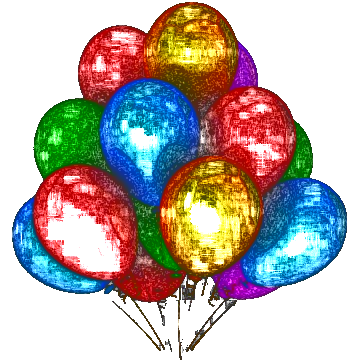

# Cartoonify
A desktop program to turn real photos into cartoon, ink, and colored pencil sketches. 
Featured in Ravenscroft [magazine](https://magazine.ravenscroft.org/our-ravens/orsp/~board/voices/post/seminar-guest-speaker-explore-potential-of-aimachine-learning)!

## Example

| Original Image | Cartoon Sketch | Ink Sketch | Colored Pencil Sketch |
|----------------|----------------|------------|------------------------|
|  |  |  |  |

## Instructions
1) Select an Image. It must be a PNG or JPG file and for best results, it should be high quality
2) Click Load Image to check if you have the correct image file.
3) Choose either Cartoon, Ink Sketch, or Colored Pencil. 
4) Wait a couple seconds for the image to load. The final image will be displayed on the screen and will also be saved in your directory.

## Dependencies
numpy, opencv, matplotlib, PySimpleGUI, PIL

<h4>Liked the work ?</h4>
Give the repository a ⭐ :)
